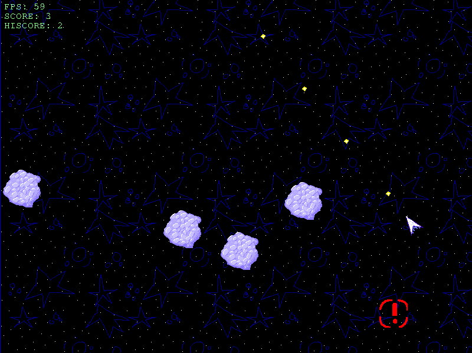

# asteroids-js

This is an asteroids clone I wrote in JavaScript for my school's coding club officer application. I made it in my free time over the course of 3-4 days and it uses the HTML5 canvas for drawing.

## Installation

-   Clone the repository
-   Run `npm install` to install dependencies
-   Run `npm run dev` to start the development server
-   Open `localhost:5173` in your browser

## Usage

-   Use the arrow keys to turn and accelerate your ship, or slow down
-   Use the Z key to shoot
-   As the game runs, asteroids will increasingly fill the screen, and you must last as long as possible, cautiously drifting around them and shooting them to pieces to survive.
-   When an asteroid is about to spawn, an alert will be displayed where it will pop up
-   The game ends when you collide with an asteroid
-   An in-game screenshot is shown below:

## Documentation

This game also comes with a detailed breakdown of its code, aimed to teach people how it was made and how to make their own JavaScript games, found in [doc.html](doc.html). It is also hosted on my website at https://lukelawlor.codeberg.page/software/asteroids/doc.html

## Contributing

Pull requests are welcome. For major changes, please open an issue first to discuss what you would like to change.

## License

[GNU](LICENSE)
